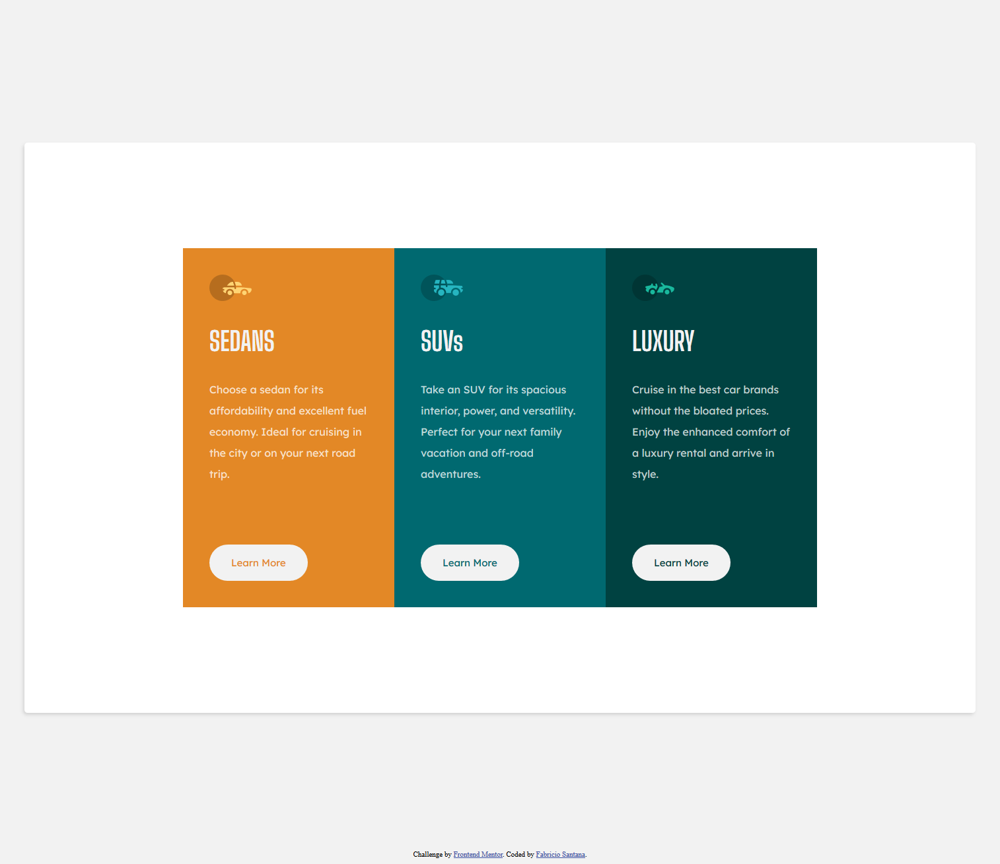

# Frontend Mentor - 3-column preview card component solution

This is a solution to the [3-column preview card component challenge on Frontend Mentor](https://www.frontendmentor.io/challenges/3column-preview-card-component-pH92eAR2-). Frontend Mentor challenges help you improve your coding skills by building realistic projects. 

## Table of contents

- [Overview](#overview)
  - [The challenge](#the-challenge)
  - [Screenshot](#screenshot)
  - [Links](#links)
  - [Built with](#built-with)
  - [Continued development](#continued-development)
- [Author](#author)

**Note: Delete this note and update the table of contents based on what sections you keep.**

## Overview

### The challenge

Users should be able to:

- View the optimal layout depending on their device's screen size
- See hover states for interactive elements

### Screenshot

### Links

- Solution URL: https://github.com/fabsantana/Frontend-Mentor--3-Column-Preview

### Built with

- Semantic HTML5 markup
- CSS custom properties
- Flexbox

### What I learned
-How to the state of buttons using the :hover selector
-How to change the layout of a page depending on the size of the viewport using media queries

### Continued development

I dont think I did a complete job of implementing the right sizing with the media queries so I want to continue working on that.

## Author

Fabricio Santana
- Frontend Mentor - https://www.frontendmentor.io/profile/fabsnta

